<div align="center">
  
  
  # ReadYours - Personalized Language Learning App
  
  **AI-Powered Reading & Vocabulary Companion**

  <a href="https://apps.apple.com/us/app/readyours-ai-language-reading/id6751147031">
    
  </a>
  <a href="https://play.google.com/store/apps/details?id=com.fdapps.readyours">
    
  </a>
  <br><br>
  
  
  
  

  *Note: This repository serves as a technical showcase. The source code is closed-source to protect intellectual property.*
</div>

---

## 📱 App Preview

<p align="center">
  
  
  
  
</p>
<p align="center">
  
  
  
  
</p>

---

## 🎯 About The Project

**ReadYours** is an innovative language learning application that leverages artificial intelligence to generate personalized reading materials. Users can generate stories or articles based on their exact proficiency level (A1-C2), preferred topics, and desired length.

The core philosophy of ReadYours is that **language acquisition is most effective when the content is engaging and tailored to the reader's interests.**

---

## 🧠 Core Architecture: The `generate-story` Pipeline

The most complex and vital piece of architecture in ReadYours is the **Story Generation Pipeline**. To ensure maximum performance, security, and separation of concerns, the entire generation and processing pipeline runs on the backend via a **Supabase Edge Function** (`generate-story`). The mobile client simply sends the user's preferences and waits for the final, fully-processed result.

### 🔄 The Backend Data Flow

```mermaid
sequenceDiagram
    autonumber
    participant Client as React Native App
    participant Edge as Supabase Edge Function<br>(generate-story)
    participant AI as Gemini AI API
    participant GCP as GCP Cloud Function<br>(spaCy NLP)
    participant DB as Supabase DB

    Client->>Edge: Invoke generate-story with parameters (Level, Topic, Length)
    
    rect rgb(30, 41, 59)
    note right of Edge: Phase 1: AI Generation
    Edge->>AI: Request 1: Generate core story constraints
    AI-->>Edge: Return structure
    Edge->>AI: Request 2: Generate final story text based on structure
    AI-->>Edge: Return raw story text
    end
    
    rect rgb(51, 65, 85)
    note right of Edge: Phase 2: NLP Processing
    Edge->>GCP: Send raw text for NLP processing
    Note right of GCP: Python/spaCy: Sentence splitting, Tokenization, Stemming
    GCP-->>Edge: Return structured NLP data (Stems, Sentences, Words)
    end
    
    rect rgb(71, 85, 105)
    note right of Edge: Phase 3: Translation & Persistence
    Edge->>Edge: Perform translations for unique words & sentences
    Edge->>DB: Save Story -> Sentences -> Words
    DB-->>Edge: Transaction Success
    end
    
    Edge-->>Client: Return completely processed and saved Story Object
    Client-->>User: Render Interactive Reading UI
```



### 💻 Implementation Highlight: Supabase Edge Function
Here is a conceptual look at how the `generate-story` edge function acts as the central orchestrator for the AI and NLP services.

```typescript
// supabase/functions/generate-story/index.ts
import "jsr:@supabase/functions-js/edge-runtime.d.ts"
import { GoogleGenerativeAI } from "npm:@google/generative-ai"
import { createClient } from "npm:@supabase/supabase-js@2"

// Specialized Error Handling for AI unreliability
class RetryableAIError extends Error { /* ... */ }
class FatalAIError extends Error { /* ... */ }

serve(async (req) => {
  try {
    const requestData = await req.json();
    
    // 1. Generate Prompt Directives (AI's Content Strategy)
    const directivesPrompt = createDirectivesPrompt(requestData);
    const directivesResponse = await gemini.generateContent(directivesPrompt);
    
    // 2. Generate Final Story Text based on Directives
    const storyPrompt = createStoryPrompt(requestData, directivesResponse);
    const rawStoryText = await gemini.generateContent(storyPrompt);

    // 3. NLP Processing via GCP (Sentence Splitting & Tokenization)
    // Sends the raw text to our Python spaCy Cloud Function
    const nlpResponse = await fetch('https://[GCP-REGION]-[PROJECT].cloudfunctions.net/stem-words', {
      method: 'POST',
      body: JSON.stringify({ text: rawStoryText }),
    });
    const { sentences, words, stems } = await nlpResponse.json();

    // 4. Batch Translation Pipeline
    const translatedSentences = await translationService.translateSentences(sentences);
    const translatedWords = await translationService.translateWords(stems);

    // 5. Structure & Persist to Supabase Database
    const finalStoryData = assembleStructuredContent(rawStoryText, translatedSentences, translatedWords);
    await supabaseClient.from('stories').insert(finalStoryData);

    return new Response(JSON.stringify({ success: true, structured_content: finalStoryData }), { status: 200 });

  } catch (error) {
    if (error instanceof RetryableAIError) {
      // Implement backoff or fallback model strategy
    }
    return new Response(JSON.stringify({ error: error.message }), { status: 500 });
  }
})
```

---

## 📖 Feature: Interactive Reading

Because the backend Edge Function completely pre-processes the text into a structured JSON format (Words belonging to Sentences, Sentences belonging to a Story) with all roots and translations ready, the client UI rendering is highly optimized.

### 💻 Implementation Highlight: Render Engine
We use React Native's `Text` component nesting to create fluid, clickable paragraphs without sacrificing performance.

```javascript
// src/components/StoryContent.js
import React from 'react';
import { View, Text } from 'react-native';

// Memoized to prevent thousands of unnecessary re-renders when a single word's state changes
const MemoizedClickableText = React.memo(({ token, sentenceId, paragraphId, translations, onPress }) => {
    // Only 'word' tokens are clickable (excluding punctuation and spaces)
    const handlePress = translations && onPress
        ? () => onPress(sentenceId, token.word_id, paragraphId, token.text, translations)
        : undefined;

    return (
        <Text onPress={handlePress}>
            {token.text}
        </Text>
    );
});

const StoryContent = ({ story, translationsMap, onWordClick }) => {
    // Render the structured content (Paragraphs -> Sentences -> Tokens)
    return story.structured_content.map((paragraph, pIndex) => (
        <View key={`paragraph-${pIndex}`} style={styles.paragraphContainer}>
            {/* Nesting Text components ensures native text wrapping without flexbox performance hits */}
            <Text style={styles.wordTextStyles}>
                {paragraph.sentences.flatMap((sentence) => (
                    sentence.tokens.map((token) => {
                        const key = `${paragraph.paragraph_id}-${sentence.sentence_id}-${token.word_id || token.text}`;
                        let translations = null;
                        
                        if (token.type === 'word') {
                            const newFormatKey = `${paragraph.paragraph_id}-${sentence.sentence_id}-${token.word_id}`;
                            translations = translationsMap.get(newFormatKey);
                        }

                        return (
                            <MemoizedClickableText
                                key={key}
                                token={token}
                                sentenceId={sentence.sentence_id}
                                paragraphId={paragraph.paragraph_id}
                                translations={translations}
                                onPress={onWordClick}
                            />
                        );
                    })
                ))}
            </Text>
        </View>
    ));
};

export default React.memo(StoryContent);
```

---

## 🛠️ Tech Stack & Infrastructure

- **Mobile Framework:** React Native / Expo (Cross-platform iOS & Android)
- **Backend Orchestration:** Supabase Edge Functions (Deno)
- **Database:** Supabase (PostgreSQL, Row Level Security)
- **Authentication:** Supabase Auth
- **AI Integration:** Google Gemini API (Strict prompt engineering)
- **NLP Engine:** GCP Cloud Functions (Python + spaCy) for heavy NLP tasks.
- **Monetization:** RevenueCat

## 📁 Project Architecture Overview

```text
ReadYoursProject/
├── App/                       # Main React Native (Expo) Application
│   ├── src/
│   │   ├── components/        # Reusable UI components (InteractiveSentence, etc.)
│   │   ├── screens/           # Main views (Generate, Read, Dictionary)
│   │   └── utils/             # Client-side helpers
│   └── App.js                 # App Entry Point & Navigation Wrapper
├── supabase/                  # Supabase Backend
│   └── functions/
│       └── generate-story/    # Edge Function: Orchestrates AI -> NLP -> Translations -> DB
└── gcp-functions/             # Google Cloud Functions
    └── stem-words-function/   # Python/spaCy function for algorithmic word stemming
```

---

## 📫 Contact & Support

While the code is private, we welcome feedback, bug reports, and feature requests from our users!

- **Report a Bug:** [Open an Issue](../../issues)
- **Request a Feature:** [Open an Issue](../../issues)
- **Developer Contact:** [dikmenomerf@gmail.com](mailto:dikmenomerf@gmail.com)

---
*© 2026 ReadYours. All Rights Reserved.*
