<div align="center">
  
  
  # ReadYours - Personalized Language Learning App
  
  **AI-Powered Reading & Vocabulary Companion**

  [](#)
  [](#)
  [](#)
  [](#)

  *Note: This repository serves as a technical showcase. The source code is closed-source to protect intellectual property.*
</div>

---

## 📱 App Preview

<p align="center">
  
  
  
  
</p>
<p align="center">
  
  
  
  
</p>

---

## 🎯 About The Project

**ReadYours** is an innovative language learning application that leverages artificial intelligence to generate personalized reading materials. Users can generate stories or articles based on their exact proficiency level (A1-C2), preferred topics, and desired length.

The core philosophy of ReadYours is that **language acquisition is most effective when the content is engaging and tailored to the reader's interests.**

---

## 🧠 Core Architecture: The `generate-story` Pipeline

The most complex and vital piece of architecture in ReadYours is the **Story Generation Pipeline**. It's not just about calling an AI API; it involves an intricate data processing flow that transforms raw AI output into a fully interactive learning experience.

### 🔄 The Data Flow

```mermaid
sequenceDiagram
    autonumber
    participant User
    participant Client as React Native App
    participant AI as Gemini AI API
    participant NLP as Text Processor (NLP)
    participant DB as Supabase DB

    User->>Client: Select: Level (B1), Topic (Sci-Fi), Length
    Client->>AI: Send structured prompt with strict constraints
    AI-->>Client: Return raw story text
    
    rect rgb(30, 41, 59)
    note right of Client: Complex Text Processing Phase
    Client->>NLP: Pass raw text
    NLP->>NLP: 1. Sentence Boundary Disambiguation
    NLP->>NLP: 2. Tokenize sentences into individual words
    NLP->>NLP: 3. Algorithmic Stemming (Find root forms)
    NLP->>NLP: 4. Fetch/Generate translations for unique stems
    end
    
    NLP-->>Client: Return Structured Story Object (Sentences & Tokens)
    Client->>DB: Transaction: Save Story -> Sentences -> Words
    DB-->>Client: Success Confirmation
    Client-->>User: Render Interactive Reading UI
```



### 💻 Implementation Highlight: Story Generation
Here is a conceptual look at how the pipeline is orchestrated on the client/backend before being persisted to the database.

```javascript
/**
 * Orchestrates the complete generation and processing of a new story.
 * This function handles API communication, NLP processing, and DB transactions.
 */
async function generateAndProcessStory(userPreferences) {
  try {
    // 1. Generate Raw Text via Gemini API
    const rawText = await geminiService.generateText({
      level: userPreferences.level,
      topic: userPreferences.topic,
      length: userPreferences.length
    });

    // 2. NLP Processing: Splitting and Tokenization
    // Uses custom regex and algorithms to handle edge cases in punctuation
    const sentences = textProcessor.splitIntoSentences(rawText);
    
    const processedSentences = await Promise.all(sentences.map(async (sentence, index) => {
      // Tokenize and extract stems for each word
      const tokens = textProcessor.tokenize(sentence);
      const wordsData = await stemAndTranslateService.processTokens(tokens);
      
      return {
        order: index,
        originalText: sentence,
        words: wordsData 
      };
    }));

    // 3. Persist to Supabase Database
    // We save the story, its relational sentences, and word mappings
    const savedStory = await supabaseClient.rpc('insert_complete_story', {
      user_id: userPreferences.userId,
      metadata: userPreferences,
      content: processedSentences
    });

    return savedStory;

  } catch (error) {
    errorHandler.log(error);
    throw new GenerationError("Failed to generate and process story");
  }
}
```

---

## 📖 Feature: Interactive Reading

Once the text is generated and processed, it must be rendered in a way that allows the user to interact with **every single word**.

Because we pre-processed the text into a structured JSON format (Words belonging to Sentences, Sentences belonging to a Story), the UI rendering is highly optimized.

### 💻 Implementation Highlight: Render Engine
We use React Native's `Text` component nesting to create fluid, clickable paragraphs without sacrificing performance.

```javascript
import React from 'react';
import { View, Text, TouchableOpacity } from 'react-native';

/**
 * Renders a sentence where every word is an interactive touch target.
 */
const InteractiveSentence = ({ sentence, onWordPress }) => {
  return (
    <Text style={styles.sentenceText}>
      {sentence.words.map((wordObj, index) => (
        <React.Fragment key={`${sentence.id}-word-${index}`}>
          <TouchableOpacity 
            onPress={() => onWordPress(wordObj)}
            activeOpacity={0.6}
          >
            <Text style={[
              styles.word, 
              wordObj.isUnknown && styles.highlightedWord
            ]}>
              {wordObj.original_word}
            </Text>
          </TouchableOpacity>
          {/* Preserve natural spacing */}
          <Text>{wordObj.trailing_space}</Text> 
        </React.Fragment>
      ))}
    </Text>
  );
};
```

---

## 🛠️ Tech Stack & Infrastructure

- **Mobile Framework:** React Native / Expo (Cross-platform iOS & Android)
- **Backend & Database:** Supabase (PostgreSQL, Row Level Security, RPCs)
- **Authentication:** Supabase Auth (Email & Social Logins)
- **AI Integration:** Google Gemini API (Strict prompt engineering for language leveling)
- **Cloud Functions:** GCP (Google Cloud Platform) Functions for heavy NLP tasks like word stemming.
- **State Management:** React Context API / Zustand
- **Monetization:** RevenueCat (In-app purchases and subscription management)

## 📁 Project Architecture Overview

```text
story-generator/
├── english-app/               # Main React Native (Expo) Application
│   ├── src/
│   │   ├── components/        # Reusable UI components (InteractiveSentence, etc.)
│   │   ├── config/            # API keys and environment configurations
│   │   ├── context/           # Global state (UserContext, ThemeContext)
│   │   ├── screens/           # Main views (Generate, Read, Dictionary)
│   │   ├── store/             # Local data management / Caching
│   │   ├── utils/             # NLP logic, Gemini helpers, Formatters
│   │   └── paywall/           # RevenueCat integration screens
│   ├── supabase/              # Local Supabase configurations
│   └── App.js                 # App Entry Point & Navigation Wrapper
├── gcp-functions/             # Google Cloud Functions
│   └── stem-words-function/   # Python/Node function for algorithmic word stemming
└── prd.md                     # Product Requirements Document
```

---

## 📫 Contact & Support

While the code is private, we welcome feedback, bug reports, and feature requests from our users!

- **Report a Bug:** [Open an Issue](../../issues)
- **Request a Feature:** [Open an Issue](../../issues)
- **Developer Contact:** Ömer - [LinkedIn](#)

---
*© 2026 ReadYours. All Rights Reserved.*
