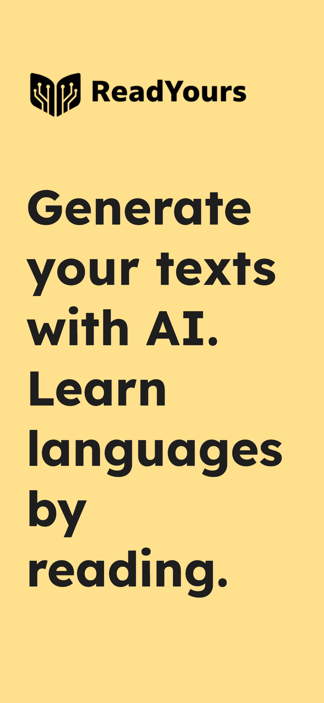
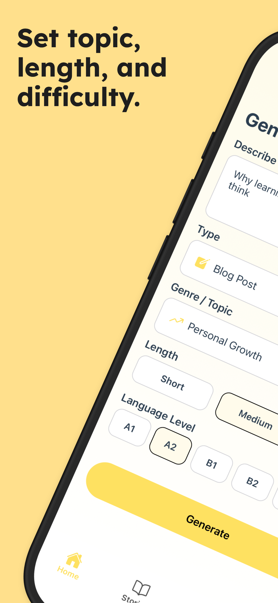
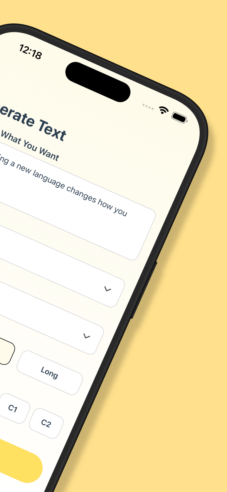
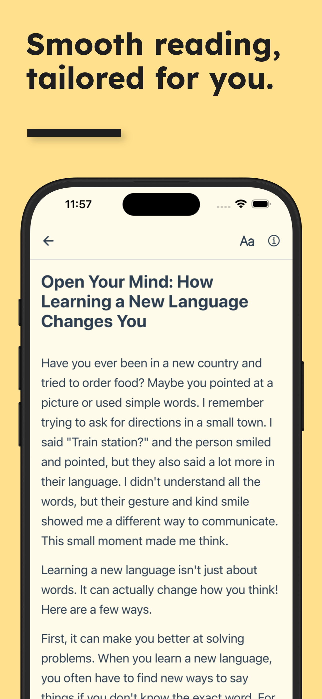
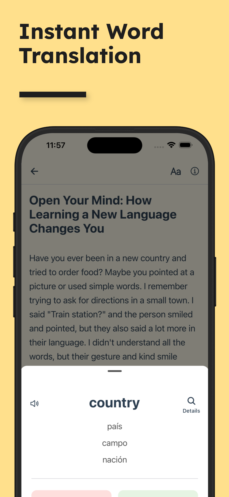
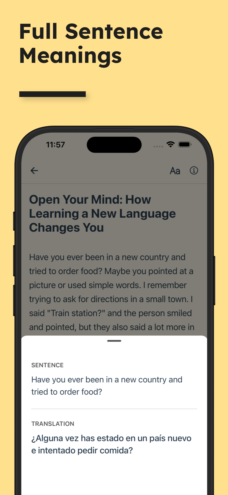
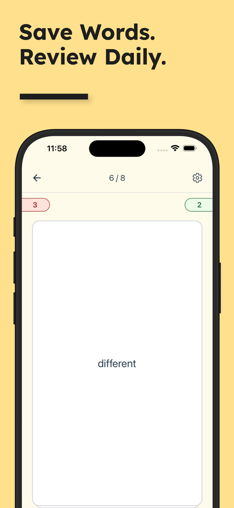
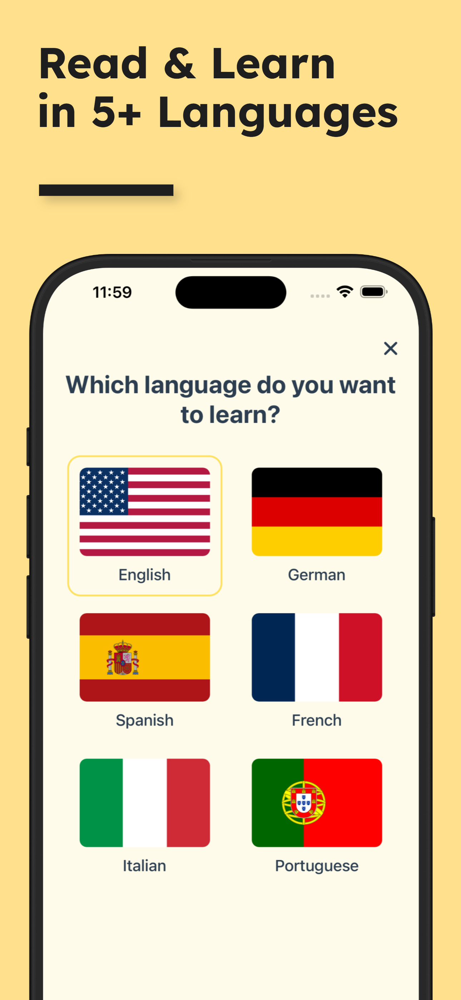

<div align="center">
  
  
  # ReadYours - Personalized Language Learning App
  
  **AI-Powered Reading & Vocabulary Companion**

  [](#)
  [](#)
  [](#)
  [](#)

  *Note: This repository serves as a technical showcase. The source code is closed-source to protect intellectual property.*
</div>

---

## 📱 App Preview

<p align="center">
  
  
  
  
</p>
<p align="center">
  
  
  
  
</p>

---

## 🎯 About The Project

**ReadYours** is an innovative language learning application that leverages artificial intelligence to generate personalized reading materials. Users can generate stories or articles based on their exact proficiency level (A1-C2), preferred topics, and desired length.

The core philosophy of ReadYours is that **language acquisition is most effective when the content is engaging and tailored to the reader's interests.**

---

## 🧠 Core Architecture: The `generate-story` Pipeline

The most complex and vital piece of architecture in ReadYours is the **Story Generation Pipeline**. To ensure maximum performance, security, and separation of concerns, the entire generation and processing pipeline runs on the backend via a **Supabase Edge Function** (`generate-story`). The mobile client simply sends the user's preferences and waits for the final, fully-processed result.

### 🔄 The Backend Data Flow

```mermaid
sequenceDiagram
    autonumber
    participant Client as React Native App
    participant Edge as Supabase Edge Function<br>(generate-story)
    participant AI as Gemini AI API
    participant GCP as GCP Cloud Function<br>(spaCy NLP)
    participant DB as Supabase DB

    Client->>Edge: Invoke generate-story with parameters (Level, Topic, Length)
    
    rect rgb(30, 41, 59)
    note right of Edge: Phase 1: AI Generation
    Edge->>AI: Request 1: Generate core story constraints
    AI-->>Edge: Return structure
    Edge->>AI: Request 2: Generate final story text based on structure
    AI-->>Edge: Return raw story text
    end
    
    rect rgb(51, 65, 85)
    note right of Edge: Phase 2: NLP Processing
    Edge->>GCP: Send raw text for NLP processing
    Note right of GCP: Python/spaCy: Sentence splitting, Tokenization, Stemming
    GCP-->>Edge: Return structured NLP data (Stems, Sentences, Words)
    end
    
    rect rgb(71, 85, 105)
    note right of Edge: Phase 3: Translation & Persistence
    Edge->>Edge: Perform translations for unique words & sentences
    Edge->>DB: Save Story -> Sentences -> Words
    DB-->>Edge: Transaction Success
    end
    
    Edge-->>Client: Return completely processed and saved Story Object
    Client-->>User: Render Interactive Reading UI
```



### 💻 Implementation Highlight: Supabase Edge Function
Here is a conceptual look at how the `generate-story` edge function acts as the central orchestrator for the AI and NLP services.

```typescript
// supabase/functions/generate-story/index.ts
import { serve } from 'https://deno.land/std@0.168.0/http/server.ts'

serve(async (req) => {
  try {
    const { level, topic, length, userId } = await req.json()

    // 1. Generate Raw Text (Two-step Gemini flow)
    const promptStructure = await gemini.createStructure(level, topic);
    const rawStoryText = await gemini.generateFinalText(promptStructure, length);

    // 2. NLP Processing via GCP Cloud Function (spaCy)
    const nlpResponse = await fetch('https://[GCP-REGION]-[PROJECT].cloudfunctions.net/stem-words', {
      method: 'POST',
      body: JSON.stringify({ text: rawStoryText }),
    });
    const { sentences, words, stems } = await nlpResponse.json();

    // 3. Translation Pipeline
    const translatedSentences = await translationService.translateSentences(sentences);
    const translatedWords = await translationService.translateWords(stems);

    // 4. Combine and Persist to Database
    const finalStoryData = assembleStoryObject(rawStoryText, translatedSentences, translatedWords);
    await supabaseClient.from('stories').insert(finalStoryData);

    // Return the final result to the client
    return new Response(JSON.stringify(finalStoryData), { status: 200 })

  } catch (error) {
    return new Response(JSON.stringify({ error: error.message }), { status: 500 })
  }
})
```

---

## 📖 Feature: Interactive Reading

Because the backend Edge Function completely pre-processes the text into a structured JSON format (Words belonging to Sentences, Sentences belonging to a Story) with all roots and translations ready, the client UI rendering is highly optimized.

### 💻 Implementation Highlight: Render Engine
We use React Native's `Text` component nesting to create fluid, clickable paragraphs without sacrificing performance.

```javascript
import React from 'react';
import { View, Text, TouchableOpacity } from 'react-native';

/**
 * Renders a sentence where every word is an interactive touch target.
 */
const InteractiveSentence = ({ sentence, onWordPress }) => {
  return (
    <Text style={styles.sentenceText}>
      {sentence.words.map((wordObj, index) => (
        <React.Fragment key={`${sentence.id}-word-${index}`}>
          <TouchableOpacity 
            onPress={() => onWordPress(wordObj)}
            activeOpacity={0.6}
          >
            <Text style={[
              styles.word, 
              wordObj.isUnknown && styles.highlightedWord
            ]}>
              {wordObj.original_word}
            </Text>
          </TouchableOpacity>
          {/* Preserve natural spacing */}
          <Text>{wordObj.trailing_space}</Text> 
        </React.Fragment>
      ))}
    </Text>
  );
};
```

---

## 🛠️ Tech Stack & Infrastructure

- **Mobile Framework:** React Native / Expo (Cross-platform iOS & Android)
- **Backend Orchestration:** Supabase Edge Functions (Deno)
- **Database:** Supabase (PostgreSQL, Row Level Security)
- **Authentication:** Supabase Auth
- **AI Integration:** Google Gemini API (Strict prompt engineering)
- **NLP Engine:** GCP Cloud Functions (Python + spaCy) for heavy NLP tasks.
- **Monetization:** RevenueCat

## 📁 Project Architecture Overview

```text
story-generator/
├── english-app/               # Main React Native (Expo) Application
│   ├── src/
│   │   ├── components/        # Reusable UI components (InteractiveSentence, etc.)
│   │   ├── screens/           # Main views (Generate, Read, Dictionary)
│   │   └── utils/             # Client-side helpers
│   └── App.js                 # App Entry Point & Navigation Wrapper
├── supabase/                  # Supabase Backend
│   └── functions/
│       └── generate-story/    # Edge Function: Orchestrates AI -> NLP -> Translations -> DB
└── gcp-functions/             # Google Cloud Functions
    └── stem-words-function/   # Python/spaCy function for algorithmic word stemming
```

---

## 📫 Contact & Support

While the code is private, we welcome feedback, bug reports, and feature requests from our users!

- **Report a Bug:** [Open an Issue](../../issues)
- **Request a Feature:** [Open an Issue](../../issues)
- **Developer Contact:** Ömer - [LinkedIn](#)

---
*© 2026 ReadYours. All Rights Reserved.*
